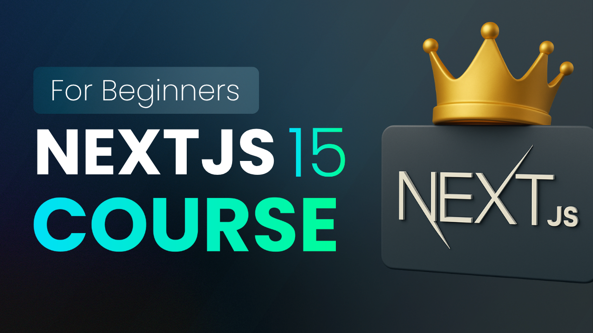

# Next.js 15 Full Course for Beginners

<div align="center">
  <br />
  <a href="https://youtu.be/6jQdZcYY8OY" target="_blank">
    
  </a>
  <br />
  <div>
    
    
    
    
  </div>
  <h3 align="center">Master Next.js 15 from Scratch with App Router, SEO, Server Components, and More</h3>
  <div align="center">
    Follow along with our full crash course on 
    <a href="https://youtu.be/YOUR_VIDEO_ID" target="_blank"><b>YouTube</b></a>
  </div>
  <br />
</div>

## 📋 Table of Contents

1. [Introduction](#introduction)
2. [Tech Stack](#tech-stack)
3. [Features](#features)
4. [Quick Start](#quick-start)
5. [Code Concepts](#code-concepts)
6. [Project Structure](#project-structure)

## 🚀 Introduction

In this **1h 18m full beginner course**, you’ll learn how to build web apps using **Next.js 15** and master its powerful features like the **App Router**, **Server Components**, **Metadata/SEO**, **dynamic routing**, **loading/error states**, and **API routes** — all while working with **TypeScript**. This course is perfect for React developers who want to level up their fullstack skills.

📺 [Watch the full tutorial on YouTube](https://youtu.be/YOUR_VIDEO_ID)

## ⚙️ Tech Stack

* **Next.js 15** – Modern React framework with built-in routing, SSR, and more
* **React 19** – Core library for building UI components
* **TypeScript** – Type-safe development experience
* **Node.js** – Runtime for running the dev server

## ⚡️ Features

* ✅ **Next.js App Router** (file-based routing)
* 🧠 **Server vs Client Components**
* 🌐 **SEO Optimization with Metadata API**
* 🔁 **Dynamic Routes and Route Params**
* ⏳ **Loading and Error UI States**
* 📡 **API Routes for Backend Logic**
* 🧩 **Folder Structure Best Practices**

## 👌 Quick Start

### Prerequisites

* Node.js (v18+ recommended)
* npm, pnpm, or yarn
* Code editor (like VSCode)

### Getting Started

```bash
npx create-next-app@latest my-app
cd my-app
npm install
npm run dev
```

### Enabling App Router & TypeScript

Make sure to choose:

* `Yes` for **App Router**
* `Yes` for **TypeScript**
* `Yes` for **Tailwind CSS**
* `Yes` for **ESLint**

## 💻 Code Concepts

### 📂 Routing

Create routes using the `app/` folder structure:

```
app/
├─ page.tsx         // Home route
├─ about/
│  └─ page.tsx      // /about route
├─ users/
│  ├─ page.tsx      // /users
│  └─ [id]/         // Dynamic route
│     └─ page.tsx   // /users/:id
```

### 🚀 Server Components

Use server components by default, and client components by adding:

```tsx
'use client';
```

### 📡 API Routes

Create backend endpoints directly in your app:

```
app/api/hello/route.ts
```

```ts
import { NextResponse } from "next/server";

export async function GET() {
  return NextResponse.json({ message: "Hello from API" });
}
```

## 📁 Project Structure

```bash
app/
│
├── layout.tsx            # Root layout
├── page.tsx              # Home page
├── about/page.tsx        # About route
├── users/page.tsx        # List of users
├── users/[id]/page.tsx   # Dynamic user profile
├── api/hello/route.ts    # API endpoint
│
├── components/           # Client components (e.g. Navbar)
├── lib/                  # Utility functions, db clients
├── public/               # Static assets (images, favicons)
```

---

This course gives you everything you need to go from *zero to deployed* with Next.js. If you enjoy it, make sure to like, subscribe, and check out the [ReactJS course](https://react.pedrotech.co) as well!

---

Let me know if you want me to generate the banner or badge graphics too!
